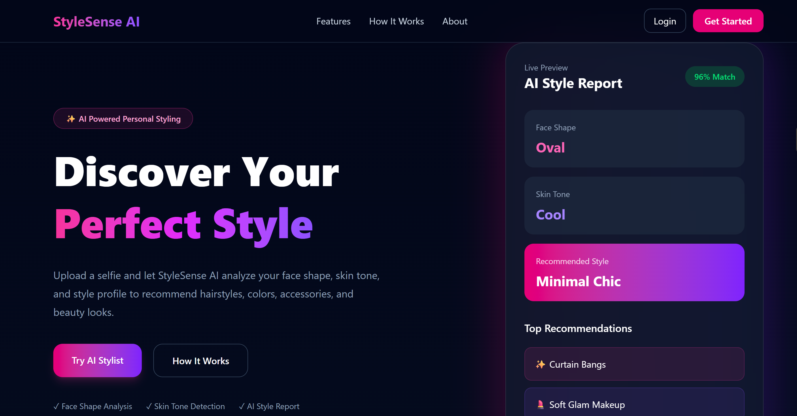
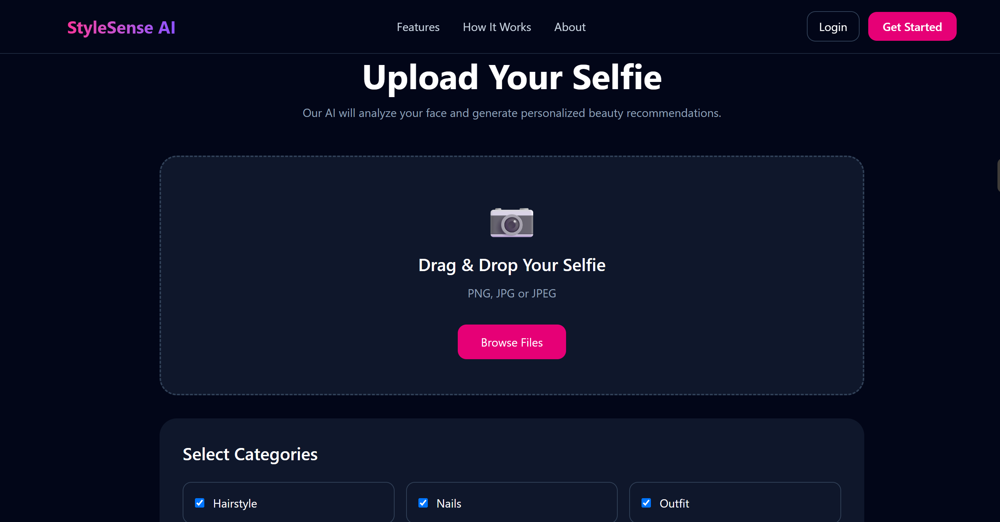
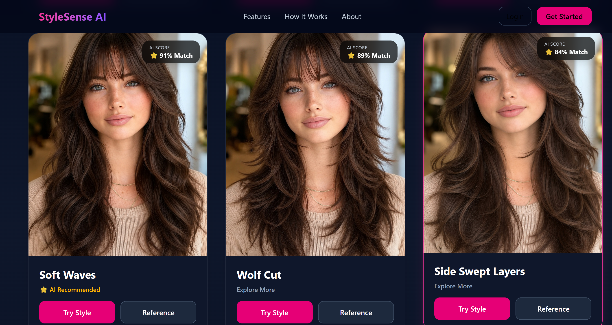

# StyleSense AI

StyleSense AI is an AI-powered personal styling web application that analyzes a user's face shape and skin tone to recommend suitable hairstyles and beauty styling ideas.

## Live Demo

https://stylesense-ai-if1b.onrender.com

## Features

- AI-based face detection
- Face shape analysis
- Skin tone detection
- Personalized hairstyle recommendations
- Dynamic match scores
- Best Match and AI Recommended ranking
- Reference hairstyle preview
- AI hairstyle try-on with graceful fallback
- Responsive modern UI
- Deployed full-stack application

## Tech Stack

### Frontend
- React
- Vite
- Tailwind CSS
- Axios

### Backend
- FastAPI
- OpenCV
- MediaPipe
- Pillow
- Replicate AI

### Deployment
- Render
- GitHub

## Project Structure

```text
StyleSense-AI/
├── backend/
│   ├── app.py
│   ├── routes/
│   ├── services/
│   └── requirements.txt
├── frontend/
│   ├── src/
│   ├── public/
│   └── package.json
├── docs/
└── README.md
```

## How It Works

1. Upload a selfie.
2. The backend detects facial landmarks using MediaPipe.
3. Face shape and skin tone are analyzed.
4. Personalized hairstyle recommendations are generated.
5. Users can preview reference hairstyles or generate AI-powered hairstyle previews.

## Current Scope

This version focuses on AI-powered hairstyle recommendations based on facial analysis. The application is designed with a modular architecture, making it easy to extend with additional personal styling features in future releases.

## Future Enhancements

- User authentication
- Personalized style history
- Makeup recommendations
- Glasses recommendations
- Outfit color suggestions
- Accessories recommendations
- Advanced AI styling report
- Mobile application

## 📸 Preview

### Home


### Upload


### Recommendations

